 

  I build focused developer tools, local-first software and small products with an emphasis on inspectable behavior and practical automation.

  
  
  

 

## 🚀 Featured Projects

Four selected public projects are shown as large animated cards. Stars, forks, primary language and update dates are refreshed automatically by GitHub Actions.

 

## 🧩 More Projects

 

## 🛠 Languages & Tools

 

## ⚡ Contribution Trail — Chakra Mode

Instead of a plain stats panel, this section is built as an animated action scene: rotating blue chakra, a pulsing ultimate burst, a giant fox-like chakra aura, moving sparks and a glowing contribution-style trail.

  

 

---

`small scope` · `clear behavior` · `working software`

Featured project metadata refreshes automatically. Profile visuals are repository-owned animated SVG assets.

