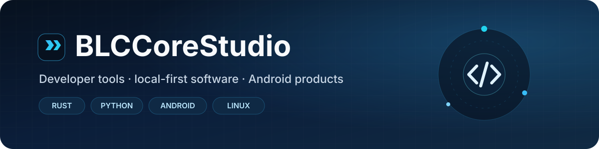

<div align="center">



[](https://github.com/BLCCoreStudio/AgentContextMap)
[](https://github.com/marketplace/actions/repodoctor-ci)


### Independent developer work focused on repository tooling, Linux workflows, CI/CD, and safer AI-assisted development.

[**Explore AgentContextMap →**](https://github.com/BLCCoreStudio/AgentContextMap) · [**Try RepoDoctor CI →**](https://github.com/marketplace/actions/repodoctor-ci)

</div>

---

## Engineering focus

- Build practical developer tools with clear failure modes, documented limitations, and reproducible releases.
- Work primarily across **Rust, Python, Linux, Git/GitHub, GitHub Actions, CI/CD, repository analysis, and automation**.
- Contribute small, test-backed fixes upstream and document the reasoning behind changes.
- Prefer local-first workflows, conservative automation, and explicit security boundaries.

## Start here — two flagship tools

### 🧭 AgentContextMap

**[AgentContextMap](https://github.com/BLCCoreStudio/AgentContextMap)** maps which repository instructions can affect Codex, Claude Code, Gemini CLI, GitHub Copilot, Cursor, Windsurf, and Cline.

It is **local, read-only, and deterministic**: no LLM calls, no repository uploads, and no execution of repository instructions. The stable **v0.2.3** release includes a GitHub Action, SARIF 2.1.0 output for Code Scanning, conflict detection, target-path analysis, GitHub Actions job summaries, checksum verification, and a self-contained HTML report.

```yaml
- uses: BLCCoreStudio/AgentContextMap@v0.2.3
  with:
    path: .
```

[Explore the project](https://github.com/BLCCoreStudio/AgentContextMap) · [Use it in GitHub Actions](https://github.com/BLCCoreStudio/AgentContextMap#github-actions) · [Download v0.2.3](https://github.com/BLCCoreStudio/AgentContextMap/releases/tag/v0.2.3)

### 🩺 RepoDoctor CI

**[RepoDoctor](https://github.com/BLCCoreStudio/RepoDoctor)** scores repository health across security, testing, documentation, CI/CD, dependencies, configuration, repository structure, and architecture — with optional CI quality gates.

The published **GitHub Marketplace Action v0.1.3** starts in report-only mode and can later enforce a minimum score or finding severity. The documented workflow requires only read access to repository contents.

```yaml
- uses: BLCCoreStudio/RepoDoctor@v0.1.3
```

[Explore RepoDoctor](https://github.com/BLCCoreStudio/RepoDoctor) · [View on GitHub Marketplace](https://github.com/marketplace/actions/repodoctor-ci) · [Download the Linux CLI](https://github.com/BLCCoreStudio/RepoDoctor/releases/tag/v0.1.1)

---

## Upstream open-source work

Recent contributions focus on small, test-backed fixes in established projects.

- **Grafana Pathfinder** — [#1738](https://github.com/grafana/grafana-pathfinder-app/pull/1738) and [#1737](https://github.com/grafana/grafana-pathfinder-app/pull/1737) — **both merged upstream**.
- **Microsoft TypeSpec** — [#11791](https://github.com/microsoft/typespec/pull/11791) — generated C# model-description fix; **open / under review**.
- **Microsoft MsQuic** — [#6282](https://github.com/microsoft/msquic/pull/6282) — Linux `SOCK_CLOEXEC` datapath fix; **open / under review**.

---

## Flagship projects

| Project | Focus | Status |
| --- | --- | --- |
| 🧭 [AgentContextMap](https://github.com/BLCCoreStudio/AgentContextMap) | Maps coding-agent instruction scope, activation, conflicts, and context | **Stable v0.2.3** · Rust · MIT |
| 🩺 [RepoDoctor](https://github.com/BLCCoreStudio/RepoDoctor) | Repository health scoring and CI quality gates | **Marketplace Action v0.1.3** · Alpha |
| 🛡️ [AgentGuard](https://github.com/BLCCoreStudio/AgentGuard) | Command policy, prompt-risk scanning, and optional Linux isolation | **Development preview** · Rust · MIT |

**BLCCoreStudio** is an independent developer project namespace. The main focus is practical repository tooling, Linux-first utilities, local-first automation, and explainable safety controls for AI-assisted development.

---

## AI agent trust tooling

| Project | Focus |
| --- | --- |
| 🧾 [AgentTrail](https://github.com/BLCCoreStudio/AgentTrail) | Wrapped command evidence, integrity-verifiable receipts, and read-only working-tree review hints |
| 🩻 [MCPDoctor](https://github.com/BLCCoreStudio/MCPDoctor) | Local MCP configuration review, executable diagnostics, and baseline drift checks |
| 🧼 [ContextGuard](https://github.com/BLCCoreStudio/ContextGuard) | Local redaction of secrets and sensitive project context before sharing with AI tools |

Earlier focused experiments are being consolidated into these primary projects instead of expanding the portfolio with overlapping tools.

---

## Released Linux utilities

| Project | What it does | Release |
| --- | --- | --- |
| 🔐 [EnvGuard](https://github.com/BLCCoreStudio/EnvGuard) | Detects secrets and sensitive files before they reach Git | [v0.1.0](https://github.com/BLCCoreStudio/EnvGuard/releases/tag/v0.1.0) |
| 🔌 [PortPeek](https://github.com/BLCCoreStudio/PortPeek) | Finds the process using a TCP or UDP port on Linux | [v0.1.0](https://github.com/BLCCoreStudio/PortPeek/releases/tag/v0.1.0) |
| 💾 [DiskHog](https://github.com/BLCCoreStudio/DiskHog) | Finds files and directories consuming the most disk space | [v0.1.0](https://github.com/BLCCoreStudio/DiskHog/releases/tag/v0.1.0) |
| #️⃣ [HashCheck](https://github.com/BLCCoreStudio/HashCheck) | Calculates and verifies SHA-256/SHA-512 checksums and release manifests | [v0.1.0](https://github.com/BLCCoreStudio/HashCheck/releases/tag/v0.1.0) |
| ⏱️ [BuildTimer](https://github.com/BLCCoreStudio/BuildTimer) | Measures command durations and keeps local timing history | [v0.1.0](https://github.com/BLCCoreStudio/BuildTimer/releases/tag/v0.1.0) |
| 🧹 [GitClean](https://github.com/BLCCoreStudio/GitClean) | Finds generated build/cache directories with dry-run and Git-aware safeguards | [v0.1.0](https://github.com/BLCCoreStudio/GitClean/releases/tag/v0.1.0) |
| 🔔 [TaskBell](https://github.com/BLCCoreStudio/TaskBell) | Notifies you when long-running terminal commands finish | [v0.1.0](https://github.com/BLCCoreStudio/TaskBell/releases/tag/v0.1.0) |

**[TermKeys](https://github.com/BLCCoreStudio/TermKeys)** is a separate proprietary Linux terminal-shortcut utility with a public release and documentation surface.

---

## Engineering approach

- **Local-first** where practical; avoid unnecessary accounts, uploads, and telemetry.
- **Conservative defaults** around destructive or security-sensitive behavior.
- **Explicit limitations** instead of overstating what a tool can prove.
- **Verifiable releases** with versioned artifacts and checksum material where applicable.

<div align="center">

### Build useful things. Keep them clear. Make them reliable.

[](https://github.com/BLCCoreStudio/AgentContextMap)
[](https://github.com/marketplace/actions/repodoctor-ci)

</div>