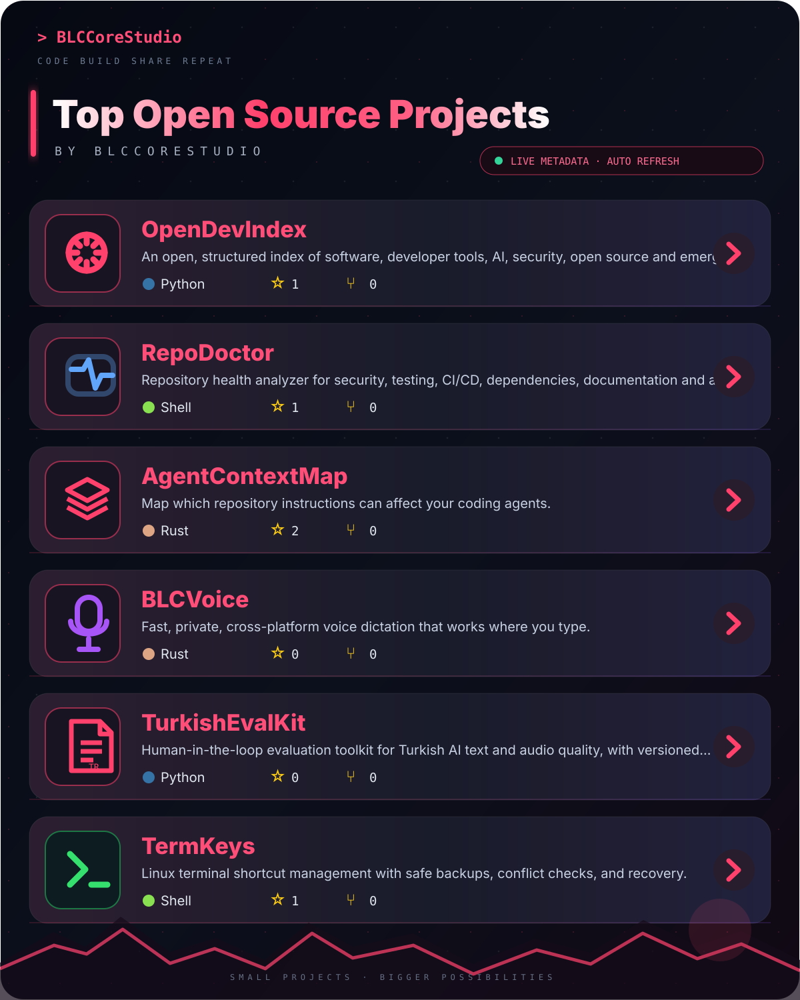

 

  I build focused developer tools and local-first software with an emphasis on inspectable behavior, practical automation and small, useful products.

  
  
  

 

## Live project board

The board below is generated from the GitHub API and refreshed automatically by GitHub Actions, so stars, forks, languages and update dates can stay current without hand-editing the profile.

<table>
<tr>
<td width="50%" valign="top">

### [OpenDevIndex](https://github.com/BLCCoreStudio/OpenDevIndex)
A structured, source-backed index of software, developer tools, AI, security, open source and emerging technology.

### [RepoDoctor](https://github.com/BLCCoreStudio/RepoDoctor)
Repository health analysis for security, testing, CI/CD, dependencies, documentation and architecture.

### [TurkishEvalKit](https://github.com/BLCCoreStudio/TurkishEvalKit)
Tools for evaluating Turkish AI text and audio with review, calibration and reliability workflows.

</td>
<td width="50%" valign="top">

### [AgentContextMap](https://github.com/BLCCoreStudio/AgentContextMap)
A local, read-only tool for seeing which repository instructions can affect coding agents, including scope, conflicts and precedence.

### [BLCVoice](https://github.com/BLCCoreStudio/BLCVoice)
A privacy-focused, local-first voice dictation project.

### [TermKeys](https://github.com/BLCCoreStudio/TermKeys)
A small Linux utility for managing terminal shortcuts and aliases more safely.

</td>
</tr>
</table>

 

## GitHub telemetry

  
  

 

## Contribution trail

  <picture>
    <source media="(prefers-color-scheme: dark)" srcset="https://raw.githubusercontent.com/BLCCoreStudio/BLCCoreStudio/output/github-contribution-grid-snake-dark.svg" />
    <source media="(prefers-color-scheme: light)" srcset="https://raw.githubusercontent.com/BLCCoreStudio/BLCCoreStudio/output/github-contribution-grid-snake.svg" />
    
  </picture>

 

## Stack

 

## Small tools

[TaskBell](https://github.com/BLCCoreStudio/TaskBell) · [EnvGuard](https://github.com/BLCCoreStudio/EnvGuard) · [DiskHog](https://github.com/BLCCoreStudio/DiskHog) · [HashCheck](https://github.com/BLCCoreStudio/HashCheck) · [BuildTimer](https://github.com/BLCCoreStudio/BuildTimer) · [GitClean](https://github.com/BLCCoreStudio/GitClean)

 

---

`small scope` · `clear behavior` · `working software`

Live project cards refresh daily. The contribution snake is generated automatically from public activity.

